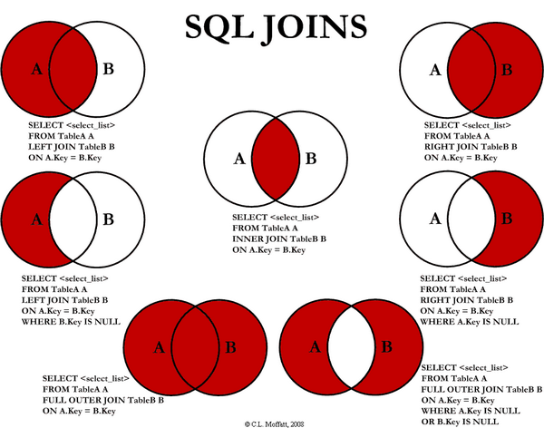

# Set

## Definition

A set is nothing more than an unordered collection of elements with absolutely no duplicates.

## When should I use it?

Basic operations are pretty time-efficient. To add, remove, find, and determine the length of a set are all **constant time** operations (`O(1)`).

In the other hand, the amount of time it takes to run the complex operations (`intersection`, `difference`, `union`, etc) depends on the length of the sets. In order to find the result to those operations, traverse through the entire sets is required (`O(length(SetX)+length(SetY))`).  

## Implementation

[click here](./Set.js) to see the implementation in JavaScript.

### Methods implemented:

- `add`
- `has`
- `clear`: remove *all* elements from the set.
- `delete`: remove *an* element from the set.
- `size`
- `values`
- `union`: yields all of the elements that exist in either of two sets.
- `intersection`: yields all of the elements that exist within two sets.
- `difference`: yields the difference between two sets, or all the elements in one (first) set that are no in the other (second) set.
- `isSubsetOf`: verify if a set is a subset of the other.
- `disjoint`*: yields all disjoint (to have no elements in common) elements.

> \* Also referred to as Disjuntive Union or Symmetric Difference.

## Fun Facts

- Relational databases are based almost entirely upon set theory.

- Hash tables are often used to implement sets:
    - keys for each element will always be unique
    - order doesn't matter
    - they provide a quick `O(1)` access time